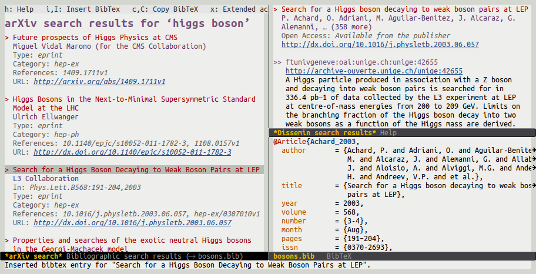

# biblio.el: An extensible Emacs package for browsing and fetching references
[](COPYING)
[](http://melpa.org/#/biblio)
[](https://travis-ci.org/cpitclaudel/biblio.el)
[](https://coveralls.io/github/cpitclaudel/biblio.el?branch=master)

*biblio.el* makes it easy to browse and gather bibliographic references and
publications from various sources, by keywords or by DOI.  References are
automatically fetched from well-curated sources, and formatted as BibTeX.



## Supported sources:

* **CrossRef**, an exhaustive academic search engine
* **arXiv**, an archive of pre-prints in various scientific fields
* **DBLP**, a database of Computer Science publications
* **HAL**, a French repository of Open Access publications
* **IEEE Xplore**, a database of Computer Science and Electrical Engineering materials
* **doi.org**, a DOI resolver (to retrieve BibTeX records from DOIs)
* **CrossCite**, an alternative DOI resolver and BibTeX formatting service
* **Dissemin**, a database tracking the open access status of scholarly articles

## Usage

Quick start: `M-x biblio-lookup`.  Each source can also be accessed independently:

* `M-x crossref-lookup` to query CrossRef
* `M-x arxiv-lookup` to query arXiv
* `M-x dblp-lookup` to query DBLP
* `M-x hal-lookup` to query HAL
* `M-x ieee-lookup` to query IEEE Xplore
* `M-x doi-insert` to insert a BibTeX record by DOI
* `M-x dissemin-lookup` to show information about the open access status of a
  particular DOI

These commands work together: for example, `crossref-lookup` displays a
list of results in `biblio-selection-mode`.  In that mode, use:

* `RET` to visit the corresponding web page
* `c` or `M-w` to copy the BibTeX record of the current entry
* `i` or `C-y` to insert the BibTeX record of the current entry
* `x` to run an extended action, such as fetching a Dissemin record

`C` and `I` do the same as `c` and `i`, but additionally close the search window.

## Examples

* To insert a clean BibTeX entry for
  [this paper](http://doi.org/10.1145/2676726.2677006) in the current buffer,
  use

        M-x crossref-lookup RET fiat deductive delaware RET i

  (the last `i` inserts the BibTeX record of the currently selected entry in your buffer).

* To find publications by computer scientist Leslie Lamport, use `M-x
  dblp-lookup RET author:Lamport RET` (see more info about DBLP's syntax at
  <http://dblp.uni-trier.de/search/>)

* To check whether an article is freely available online, use `x` in the list of
  results.  For example `M-x crossref-lookup RET emacs stallman RET` followed by
  `x Dissemin RET` will help you find open access copies of Stallman's paper on
  EMACS (spoiler: it's [here](http://hdl.handle.net/1721.1/5736)).

## Setup

Add [MELPA](http://melpa.org/#/getting-started) to your package sources, then
use `M-x package-install RET biblio RET`.

## Extending `biblio.el`

### Adding new backends

The extensibility mechanism is inspired by the one of company-mode.  See the
docstring of `biblio-backends`.  Here is the definition of `biblio-dblp-backend`,
for example:

```elisp
;;;###autoload
(defun biblio-dblp-backend (command &optional arg &rest more)
  "A DBLP backend for biblio.el.
COMMAND, ARG, MORE: See `biblio-backends'."
  (pcase command
    (`name "DBLP")
    (`prompt "DBLP query: ")
    (`url (biblio-dblp--url arg))
    (`parse-buffer (biblio-dblp--parse-search-results))
    (`forward-bibtex (biblio-dblp--forward-bibtex arg (car more)))
    (`register (add-to-list 'biblio-backends #'biblio-dblp-backend))))

;;;###autoload
(add-hook 'biblio-init-hook #'biblio-dblp-backend)
```

Note how the autoload registers the backend without loading the entire file.
When `biblio-lookup` is called by the user, it will run all functions in
`biblio-init-hook` with `'register` as their first argument, and the `dblp`
backend will be added to the list of backends add that point.

### Adding new actions

The selection mode menu has an extended action key, `x`.  The only extension at
the moment is Dissemin. Extensions `cons`es `(label . function)` added to
`biblio-selection-mode-actions-alist`; function is called with the metadata of
the current entry when the user selects `label` from the list of extensions
after pressing `x`.
